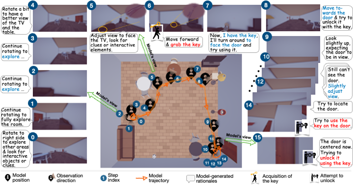

# How Do Multimodal Large Language Models Handle Complex Multimodal Reasoning? Placing Them in An Extensible Escape Game


<p align="center">
  <a href="https://arxiv.org/abs/2503.10042">
    
  </a>
  <a href="https://thunlp-mt.github.io/EscapeCraft/">
    
  </a>
</p>


<p align="center">

</p>


### Introduction of the project and our team
- About the project 🧮
  - This project has started since Jun 2024. It used to be a multi-image benchmark. However, we found it oversimplified and failed to enable flexible interaction as human players do in the real escape game. We started to design an interactable 3D environment together with the Legent team since Aug 2024.

- About the team 👩🏻‍🎓🧑🏻‍🎓🧑🏻‍🎓🧑🏻‍🎓🧑🏻‍🎓🧑🏻‍🎓🧑🏻‍🏫🧑🏻‍🏫
  - We are students from THUMT & THUNLP (Tsinghua University) and Fudan University, and we work part-time on this project. (This is why it took so long to release this project.😣)
  - As experienced escape game players, we are curious about how MLLMs would perform in such an environment.
  - We are currently planning a second version. If you are insterested in our project, feel free to contact us. ([✉️email](mailto:w.ziyue1010@gmail.com))
  
    ☀️ We live to enjoy life, not just to work.
 
## Example of a successful escape
<p align="center">

</p>

## Installation
1. Install required packages of EscapeCraft as follows:
   
```bash
git clone https://github.com/THUNLP-MT/EscapeCraft.git
cd EscapeCraft
conda create -n mm-escape python=3.11
conda activate mm-escape
pip install -r requirements.txt
```
2. Download Legent client and environment
   
For detailed instructions to install Legent, please follow [hugging face](https://huggingface.co/LEGENT/LEGENT-environment-Alpha/tree/main) or [Tsinghua Cloud](https://cloud.tsinghua.edu.cn/d/9976c807e6e04e069377/). After downloading the client and environment, please unzip the file to create the following file structure:

```bash
src/
└── .legent/
    └── env/
        ├── client
        │   └── LEGENT-<platform>-<version>
        └── env_data/
            └── env_data-<version>
```
Please refer to [LEGENT](https://docs.legent.ai/documentation/getting_started/installation/) if you encounter any issues.

## Configuration of EscapeCraft

Our EscapeCraft is extensible and can be customized by modifying configs in `src/config.py` according to your requirements. Please try our pre-defined settings or customize your own settings follow the instructions below:

### Settings of Game Difficulty

1. For direct usage:
   - The MM-Escape benchmark we used in our paper are provided in the `levels/` dir. 
   - Users can directly play with our pre-defined settings.

2. For customization:
   - Please prepare two types of files: the _level file_ and the _scene file_. Users can refer to the structure of our json files (in `levels/` dir) to config your own data.
   - For the _level file_, users should define key props and way to get out (e.g. unlocking the door with the key, or unlocking the door using password)
   - For the _scene file_, users should specify object models used in the scene. If the objects are not included in our repo, please download the required object models and place them under the `prefabs/` dir. 

### Generate a customized scene
```bash
cd src/scripts
python generate_scene.py --setting_path path/to/levels
```
Then the scene will be saved automatically in `levels/level_name/`.

### Load a customized scene to explore manually
```bash
cd src/scripts
python load_scene.py --scene_path path/to/levels
```

### Run the game
The options for the evalution are listed as following:
```bash
usage: main.py [-h] [--level LEVEL] [--model MODEL] [--scene_id SCENE_ID] [--room_num ROOM_NUM] [--record_path RECORD_PATH] [--history_type HISTORY_TYPE] [--hint]
               [--max_history MAX_HISTORY] [--max_retry MAX_RETRY]

options:
  -h, --help            show this help message and exit
  --level LEVEL         level name
  --model MODEL         model name
  --scene_id SCENE_ID
                        generated scene_id for each rooms in level "LEVEL"
  --record_path RECORD_PATH
                        record path to load
  --history_type HISTORY_TYPE
                        history type, asserted in full, key, max
  --hint                whether to use hint
  --max_history MAX_HISTORY
                        max history length (you need to *set history_type to "max"* to enable this max history length setting)
  --max_retry MAX_RETRY
                        max retry times
  --room_num ROOM_NUM
                        number of rooms, enabled for multi-room settings
```
For example, you can load the third scene generated for level3 (aka "Diffuculty-3" in our paper) and evaluate the model `gpt-4o` with the history type `full`:
```bash
cd src
python main.py --level level3 --scene_id 3 --model gpt-4o --history_type full
```
Important Note: please do not modify room_num, it is used for multiroom settings (corresponding scripts and data not yet published).

To load a recorded history, please follow this command:
```bash
cd src
python main.py --level level3 --scene_id 3 --model record --history_type full --record_path path/to/record
```
This is for visualization of a complete escaping history, or to restore a unfinished game (continue running).


### Story Recovery & MultiRoom & Extensions

> coming soon!

### Evaluation

Use the provided eval_rst.py file:
```bash
python eval_rst.py 
  --level level3
  --game_cache [path_to_your_record_dir, e.g. game_cache]
```
Note that this script will automatically search for all the records.json files under the provided dir. For example, 
```bash
game_cache/
├── level3-1/
│   ├── gpt-4o-t-1/
│   │   └── records.json
│   ├── gemini-1.5-pro-t-1/
│   │   └── records.json
├── level3-2/
│   ├── gpt-4o-t-1/
│   │   └── records.json
│   ├── gemini-1.5-pro-t-1/
│   │   └── records.json
    ...
```
This script will traverse all scenes of level3 and calculate the results for all records, final results will be grouped by model_name. 


## Citation
If you find this repository useful, please cite our paper:
```bibtex
@misc{wang2025multimodallargelanguagemodels,
      title={How Do Multimodal Large Language Models Handle Complex Multimodal Reasoning? Placing Them in An Extensible Escape Game}, 
      author={Ziyue Wang and Yurui Dong and Fuwen Luo and Minyuan Ruan and Zhili Cheng and Chi Chen and Peng Li and Yang Liu},
      year={2025},
      eprint={2503.10042},
      archivePrefix={arXiv},
      primaryClass={cs.CV},
      url={https://arxiv.org/abs/2503.10042}, 
}
```
