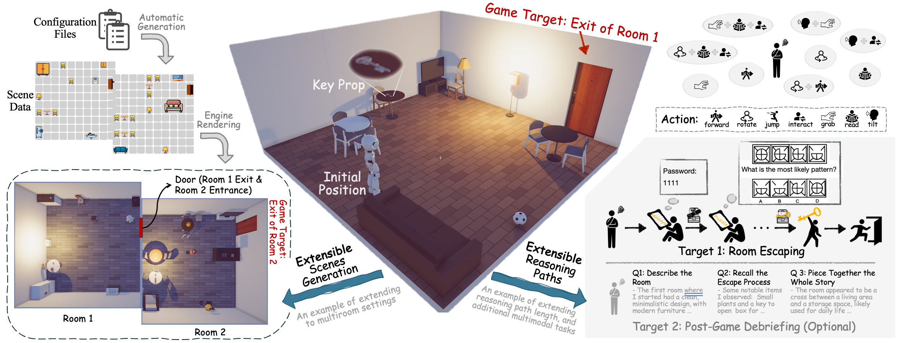

# How Do Multimodal Large Language Models Handle Complex Multimodal Reasoning? Placing Them in An Extensible Escape Game
Official repo for EscapeCraft (an 3D environment for room escape) and benchmark MM-Escape

arxiv link will be available soon.
